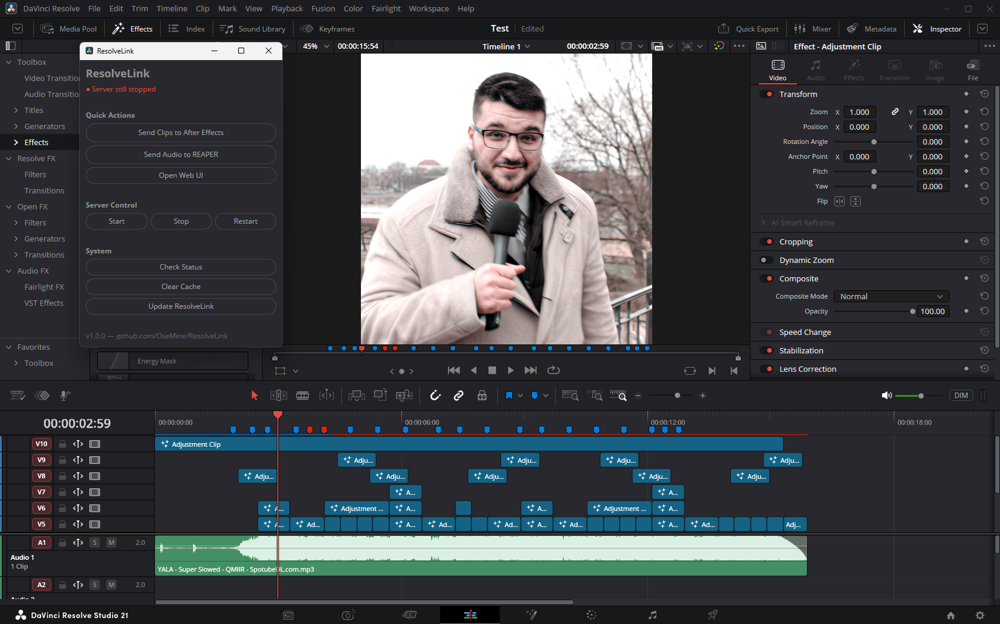
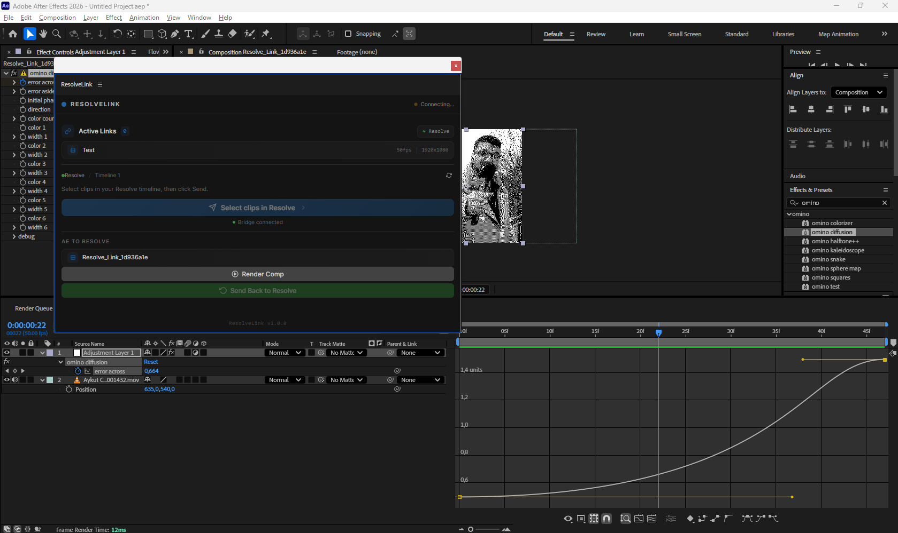
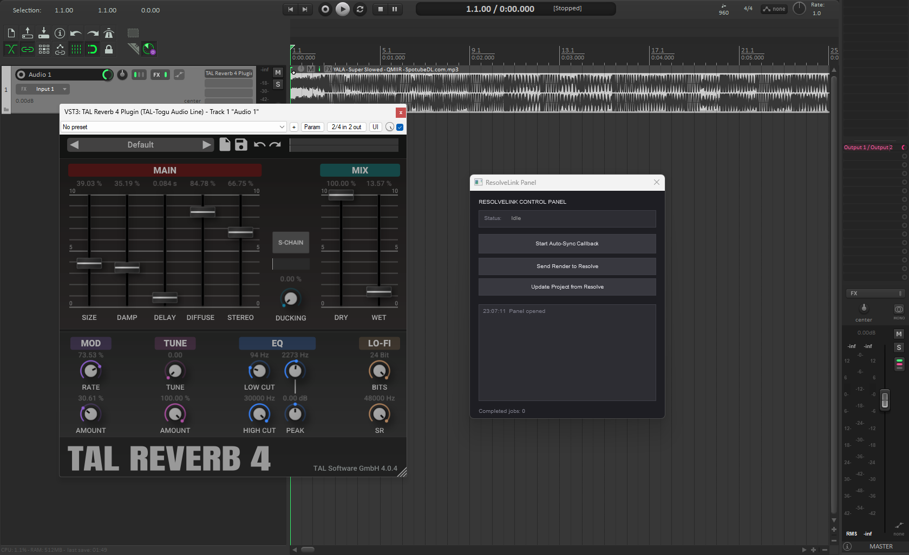

<p align="center">
  
</p>

<h1 align="center">ResolveLink</h1>

<p align="center">
  <strong>Dynamic Link equivalent for DaVinci Resolve to After Effects & REAPER</strong>
</p>

<p align="center">
  A native DaVinci Resolve Workflow Integration Plugin that bridges DaVinci Resolve with Adobe After Effects and REAPER, providing a Dynamic Link-like workflow for VFX, motion graphics, and audio post-production.
</p>

<p align="center">
  
  
  
  
  <a href="https://github.com/OseMine/ResolveLink/actions"></a>
</p>
<br>
<p align="center">
  
  
</p>

---

## Screenshots

<table align="center" cellpadding="0" cellspacing="12">
  <tr>
    <td align="center" valign="top">
      <b>DaVinci Resolve</b><br/>
      
    </td>
    <td align="center" valign="top">
      <b>After Effects</b><br/>
      
    </td>
  </tr>
  <tr>
      <td align="center" valign="top">
      <b>REAPER</b><br/>
      
    </td>
    </tr>
</table>

---

## The Problem

DaVinci Resolve lacks Adobe's Dynamic Link. When VFX work needs to happen in After Effects or audio needs to be mixed in REAPER, editors must manually export clips, open the target application, import footage, match timecodes, render, and re-import back. This breaks creative flow and wastes hours.

## The Solution

ResolveLink automates the entire round-trip. Select clips in Resolve, click one button, and a synchronized After Effects composition is created instantly. When AE work is rendered, the result automatically syncs back to the Resolve timeline as a compound clip. For audio, send clips directly to REAPER for mixing — the same round-trip workflow applies.

```
 ┌──────────────────┐      ┌──────────────────┐      ┌──────────────────┐
 │  DaVinci Resolve  │ ───> │  ResolveLink       │ ───> │  After Effects   │
 │                   │      │  Bridge Server    │      │                  │
 │  Select Clips     │      │  - REST API       │      │  CEP Extension   │
 │  Click "Send"     │      │  - File Watcher   │      │  Auto Comp       │
 │  Auto Re-import   │ <─── │  - WebSocket      │ <─── │  Render & Export │
 └──────────────────┘      └────────┬─────────┘      └──────────────────┘
                                    │
                                    │
                           ┌────────▼─────────┐
                           │                   │
                           │    REAPER DAW     │
                           │                   │
                           │  Panel UI         │
                           │  File-based IPC   │
                           │  Render & Export  │
                           └──────────────────┘
```

## Features

### After Effects
- **One-Click Send** — Select clips in the Resolve timeline, send directly to After Effects
- **Auto Composition** — Creates perfectly synchronized AE compositions with correct resolution, framerate, and timecodes
- **Auto Workflow** — If AE is running, jobs are queued for the CEP extension; if not, AE is launched with the script automatically
- **File Watcher** — Monitors render output folders and syncs completed renders back to Resolve automatically
- **Compound Clip Import** — Rendered output is automatically imported back into Resolve as a compound clip (V2 render over V1 originals)
- **CEP Extension** — Panel inside After Effects that polls for jobs, executes scripts, and handles rendering

### REAPER
- **Unified Panel** — Single GFX UI window with all controls (no dependencies required)
- **Background Callback** — Toggle ON/OFF to auto-import audio from Resolve into REAPER
- **Send Render to Resolve** — One-click render and import audio back into DaVinci
- **Update Project** — Sync REAPER items to match Resolve timeline (position, length, track)
- **File-based IPC** — No network dependency between REAPER scripts and server
- **Auto-Save** — Projects saved automatically to `exports/reaper-projects/`
- **ReaPack Repository** — Install scripts via ReaPack package manager

### General
- **Desktop App** — Electron UI for server management, project browser, and status
- **Real-time Status** — Live status indicators via WebSocket
- **Setup Wizard** — Auto-detect Python and AE paths, first-run configuration
- **Dark UI** — Matches DaVinci Resolve's professional dark theme exactly
- **Cross-Platform** — Windows, macOS, and Linux support
- **GitHub Releases** — Tagged releases with auto-generated installers

---

## Quick Start

### Windows

```powershell
iex (iwr -UseBasicParsing "https://raw.githubusercontent.com/OseMine/ResolveLink/main/install.ps1").Content
```

### macOS / Linux

```bash
curl -fsSL https://raw.githubusercontent.com/OseMine/ResolveLink/main/install.sh | bash
```

### Install via DaVinci Resolve Console (Recommended)

1. Download `install.lua` from the [latest release](https://github.com/OseMine/ResolveLink/releases)
2. Open DaVinci Resolve
3. Go to **Workspace > Console** (or press Alt+F9)
4. Paste the contents of `install.lua` and press Enter

That's it. The script will:
- Detect your OS and check for Git + Node.js
- Download the correct release version automatically
- Run the full setup (deps, build, extensions, .env)
- Deploy Resolve scripts and start the server

### Install REAPER Scripts

#### Via ReaPack (Recommended)

1. In REAPER, go to **Options > Show REAPER resource path**
2. Open `Scripts/ReaPack/Packages/`
3. Add this URL in **ReaPack > Edit repositories**:
   ```
   https://raw.githubusercontent.com/OseMine/ResolveLink/feature/reaper-integration/index.xml
   ```
4. Click **OK**, then **ReaPack > Synchronize packages**
5. Install from **ReaPack > Browse packages > ResolveLink**

#### Available Scripts

| Script | Description |
|--------|-------------|
| **ResolveLink Panel** | Unified control panel (all-in-one) |
| **ResolveLink Callback** | Background worker for auto-import |
| **ResolveLink Send to Resolve** | Render and import to DaVinci |
| **ResolveLink Update Project** | Sync REAPER to DaVinci timeline |

### Install Locations

| OS      | Path                                        |
|---------|---------------------------------------------|
| Windows | `%LOCALAPPDATA%\ResolveLink`                |
| macOS   | `~/Applications/ResolveLink`                |
| Linux   | `~/.local/share/ResolveLink`                |

---

## Configuration

On first run, the setup wizard auto-detects Python and After Effects paths and generates a `.env` file. You can re-run it anytime:

```powershell
.\scripts\setup.ps1 -Force
```

All configuration is driven by `.env`:

| Variable | Default | Description |
|----------|---------|-------------|
| `PORT` | `3030` | Server port |
| `HOST` | `127.0.0.1` | Bind address |
| `EXPORT_DIR` | `./exports` | Where renders are saved |
| `TEMP_DIR` | `./temp` | Generated scripts location |
| `PYTHON_PATH` | `python` | Python executable |
| `AE_PATH_WIN` | *(auto-detected)* | After Effects install path |
| `AE_PATH_MAC` | *(auto-detected)* | After Effects install path |
| `REAPER_PATH_WIN` | *(auto-detected)* | REAPER install path (Windows) |
| `REAPER_PATH_MAC` | *(auto-detected)* | REAPER install path (macOS) |
| `RESOLVE_SCRIPTING_PATH` | *(auto-detected)* | Resolve scripting modules |
| `WATCHER_ENABLED` | `true` | Enable file watcher |
| `WATCH_FOLDERS` | *(none)* | Extra folders to watch (comma-separated) |
| `LOG_LEVEL` | `info` | Log level (debug/info/warn/error) |

See `.env.example` for all options.

---

## Tech Stack

| Layer | Technology |
|-------|-----------|
| **Frontend UI** | React 18, TypeScript, Tailwind CSS, Lucide Icons |
| **Desktop Shell** | Electron 28 |
| **Backend Server** | Node.js, Express, Chokidar, WebSocket (ws), dotenv |
| **Resolve Bridge** | Python (DaVinciResolveScript API), Node.js child_process wrapper |
| **Adobe Automation** | CEP Extension (HTML/JS panel), ExtendScript (.jsx) |
| **REAPER Automation** | Pure GFX panel, Lua scripts, file-based IPC |
| **Testing** | Vitest (unit + integration) |

## Project Structure

```
resolvelink/
├── install.lua                 # One-step installer (paste into Resolve Console)
├── scripts/                    # Management scripts
│   ├── setup.ps1 / setup.sh   # Unified installer/updater
│   ├── start.ps1 / start.sh   # Start server
│   ├── stop.ps1 / stop.sh     # Stop server
│   ├── status.ps1 / status.sh # Check status
│   └── deploy-*.ps1           # Deploy extensions
│
├── server/                     # Backend
│   ├── index.js               # Express + WebSocket + Chokidar + Job queue
│   ├── config.json            # Default config
│   ├── resolve-service.js     # Node.js wrapper for Python bridge
│   ├── resolve-bridge.py      # Python DaVinci Resolve scripting bridge
│   └── reaper-service.js      # REAPER CLI, Lua generation, file IPC
│
├── src/                        # Frontend (React + Vite + TypeScript)
│   ├── components/            # React components
│   └── lib/                   # API client, hooks, utilities
│
├── extension/                  # CEP Extension (inside After Effects)
│   ├── CSXS/manifest.xml
│   ├── client/                # Panel UI (HTML/JS/CSS)
│   └── host/host.jsx          # ExtendScript host functions
│
├── resolve-scripts/            # DaVinci Resolve scripts
│   ├── ResolveLink.lua         # Main launcher
│   ├── send-to-ae.py          # Clip send dialog (tkinter)
│   └── send-to-reaper.py      # Audio clip send dialog (tkinter)
│
├── reaper-scripts/             # REAPER scripts
│   ├── resolve-link-panel.lua  # Unified GFX control panel (v2.2.0)
│   ├── reaper-callback.lua     # Background worker (file-based IPC)
│   ├── send-to-resolve.lua     # Render and import to DaVinci
│   └── update-project.lua      # Sync REAPER to DaVinci timeline
│
├── adobe/                      # ExtendScript library
│   └── import_pipeline.jsx    # Standalone AE composition importer
│
├── test/                       # Test suite
├── docs/                       # Documentation
├── assets/                     # Images and icons
├── exports/                    # Render output (watched)
├── temp/                       # Generated scripts and payloads
├── index.xml                   # ReaPack repository
├── RELEASE.md                  # Release notes
├── vitest.config.js            # Test config
├── electron.js                 # Electron main process
├── .env.example                # Configuration template
├── package.json
└── README.md
```

---

## Documentation

| Document | Description |
|----------|-------------|
| [Architecture](docs/ARCHITECTURE.md) | System design, data flow, component interaction |
| [API Reference](docs/API.md) | REST endpoints, WebSocket protocol, data types |
| [Setup Guide](docs/SETUP.md) | Installation, configuration, troubleshooting |
| [Workflow Guide](docs/WORKFLOW.md) | Step-by-step user workflow |
| [Release Notes](RELEASE.md) | Version history and changelog |

---

## Development

### Prerequisites

- Node.js 18+
- Python 3.10+ (for Resolve scripting bridge)
- DaVinci Resolve Studio 21+ (for scripting API)
- Adobe After Effects 2022+ (for CEP)
- REAPER 6+ *(optional, for audio post-production workflow)*

### Commands

| Command | Description |
|---------|-------------|
| `npm run dev` | Start server + Vite dev server concurrently |
| `npm run server` | Start only the backend server |
| `npm run ui` | Start only the Vite dev server |
| `npm run build` | Build the frontend for production |
| `npm start` | Start the Electron app |
| `npm test` | Run all tests (vitest) |
| `npm run test:watch` | Run tests in watch mode |

---

## How It Works

### After Effects Workflow

1. **Selection** — Editor selects clips in the Resolve timeline
2. **Send** — Clicks "Send Selection to After Effects"
3. **Translate** — Plugin reads clip metadata via the Python scripting bridge
4. **Generate** — Server creates `.jsx` + `.json`, queues job for CEP extension
5. **Execute** — CEP extension inside AE picks up the job, creates synchronized composition
6. **Edit** — VFX artist works in After Effects
7. **Render** — Artist renders (via CEP panel, plugin, or manually)
8. **Detect** — File watcher detects the new render in exports/
9. **Import** — Render is automatically imported back into Resolve as a compound clip
10. **Sync** — UI shows updated link status via WebSocket

### REAPER Workflow

1. **Selection** — Editor clicks "Send Audio to REAPER" in the Resolve launcher
2. **Dialog** — Tkinter dialog shows available audio clips for selection
3. **Generate** — Server generates Lua import script + JSON payload + render config
4. **IPC** — Server writes job file to `exports/reaper-jobs/`
5. **Execute** — Panel's callback picks up job, imports audio into REAPER
6. **Mix** — Audio engineer mixes in REAPER
7. **Save** — Project auto-saved to `exports/reaper-projects/`
8. **Render** — Engineer renders to configured export directory
9. **Import** — Panel sends rendered audio to server, imports into Resolve
10. **Sync** — Audio track added to Resolve timeline, old clips muted

---

## Keyboard Shortcuts

| Shortcut | Action |
|----------|--------|
| `Ctrl+Shift+R` | Refresh selection from Resolve |
| `Ctrl+Enter` | Send selected clips to AE |
| `Ctrl+T` | Toggle tools panel |
| `Ctrl+,` | Open setup wizard |

---

## License

MIT

---

<p align="center">
  Built for editors who refuse to break their creative flow.
</p>
